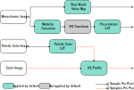

.. _pixel-transforms:

Pixel Transforms
================

A DICOM image often stores details of one or more operations that may be
applied to the pixel values stored in the object. These operations are referred
to as pixel transforms. For the purposes of pixel transforms, we can classify
images into three types:

- **Monochrome images** are those with a single sample per pixel and a
  photometric interpretation of "MONOCHROME1" or "MONOCHROME2" meaning that
  they are intended to be displayed in grayscale.
- **Color images** are those with 3 samples per pixel.
- **Palette Color images** are those stored with a single sample per pixel and
  a photometric interpretation of "PALETTE COLOR", meaning that they are
  intended to be transformed into color images (via a lookup table) before
  being displayed as color images.

Sometimes a multi-frame image may have frame-specific parameters for these
transforms, and other times they may be shared by all frames.

The following diagram shows the possible pixel transforms for each image type.
Each transform may or may not be present in a particular image. The transforms
must be applied in the order shown in the flowchart if they are present, and
missing transforms can be assumed to be the identity transform.

   Flowchart of all possible pixel transforms and their order of application
   for monochrome, palette color and color images.

Monochrome images have two alternative pathways through this flowchart, either
the real world value map is applied or some combination of the modality
transform, VOI transform, and presentation LUT is applied. The real world value
map should not be applied in combination with any of the others.

The real world value map was introduced to the standard more recently than the
modality transform, VOI transform and presentation LUT, and in most IODs its
inclusion is optional. By contrast, the modality transform is more common and
more likely to be implemented correctly by viewers. Thus it is fairly common
for an image to contain parameters for transforms on both of these pathways.

Pixel Transforms in Highdicom
-----------------------------

The :class:`highdicom.Image` class has several methods that return frames or
arrangements of frames from a DICOM image:

* :meth:`highdicom.Image.get_frame()`
* :meth:`highdicom.Image.get_volume()`
* :meth:`highdicom.Image.get_total_pixel_matrix()`

These methods share a set of parameters that control which pixel transforms are
applied and how they are applied.

The parameters ``apply_real_world_transform``, ``apply_modality_transform``,
``apply_voi_transform``, ``apply_presentation_lut``,
``apply_palette_color_lut``, and ``apply_icc_profile`` govern whether or not
the corresponding transform is applied. With the exception of
``apply_presentation_lut``, they can each take one of three values:

* ``True``, in which case the transform is always applied and an error is
  raised if the transform parameters are missing from the image object.
* ``False``, in which case the transform is never applied regardless of whether
  or not relevant parameters are found in the image object.
* ``None``, in which case the transform is applied if its parameters are found
  in the image object, but skipped without error if the parameters are not
  present. This is the default for most of the transforms (except the VOI
  transform).

If you pass ``False`` for any transform, you must also pass ``False`` for any
later transform that depends upon that transform.

The default set of parameters means that by default:

* For **monochrome images** the real world value map will be applied if it is
  present. If it is not present, the modality LUT and presentation LUT will be
  applied if they are present. The VOI transform is never applied when using
  the default parameters and must be explicitly enabled.
* For **color images** the ICC profile will be applied if it is present.
* For **palette color images**, the palette color LUT will be applied (it
  should always be present for palette color images). The ICC profile will then
  be applied if it is present.

Now we will go through the specifics of each of these transforms in turn.

Real World Value Map
--------------------

A real world value map is a transform that maps stored values to "real world"
values, meaning values that have some measurable meaning in some physical unit
rather than being simply arbitrary pixel intensities.

It may be represented by either a simple linear transform (a scale and offset),
or as an arbitrary function represented by a lookup table (LUT).

There may be multiple instances of a real world value map stored within a
sequence in an image object. The ``real_world_value_map_selector`` parameter
specifies which should be used. By default, the first item is used. Values for
``real_world_value_map_selector`` may be either:

* An ``int`` used to index the sequence of available maps (first item has index
  0). A negative integer may be used to index from the end of the list
  following standard Python indexing convention.
* A ``str`` used to match the ``"LUTLabel"`` attribute, which is a free-text
  human readable string identifying the LUT, to select the map.
* A ``pydicom.sr.coding.Code`` or ``highdicom.sr.coding.CodedConcept`` used to
  match the code describing the units of the LUT (contained in the
  ``"MeasurementUnitsCodeSequence"`` attribute). See :doc:`coding` for more
  information on using codes.

In highdicom, real world value maps are implemented using the
:class:`highdicom.pm.RealWorldValueMapping` class.

Modality Transform
------------------

The modality transform maps stored values to the modality's measured values. It
is conceptually very similar to a real world value map, except that the output
is not guaranteed to have physical meaning and the modality transform lacks
attributes associated with a real world value map that describe the meaning and
units of the output units.

As with real world value maps, the modality transform may be represented by
either a simple linear transform (a scale and offset), or as an arbitrary
function represented by a lookup table (LUT).

In highdicom, the modality transform is implemented in the
:class:`highdicom.ModalityLUTTransformation` class.

Value of Interest (VOI) Transform
---------------------------------

The value-of-interest (VOI) transform limits the range of pixel intensities to
a particular window that is relevant for a certain purpose. CT images are a
typical use case, where the range of Hounsfield units is very large and
radiologists typically use an intensity window optimized for viewing certain
organs or tissues when viewing images. Different windows are typically used for
soft tissue versus lung versus bones, for example.

Where a VOI transform is specified in a DICOM file, it is typically intended as
a suggested default setting for rendering the image in a viewer. Since the VOI
transform discards information, is application-specific, and is intended for
human viewing rather than computational analysis, highdicom does not apply the
VOI transform by default even if an image specifies one. However it can be
enabled if desired.

A VOI transform is either specified as a pair of windowing parameters (center
and width of the intensity window) or as an arbitrary function using a LUT.

There may be multiple VOI transforms stored in a file, typically for different
viewing purposes. The ``voi_transform_selector`` parameter controls which will
be used. Values for this parameter may be either:

* An ``int``, interpreted as a (zero-based) index of the list of VOI transforms
  to apply. A negative integer may be used to index from the end of the list
  following standard Python indexing convention. 
* A ``str``, used to match the ``"WindowCenterWidthExplanation"`` or the
  ``"LUTExplanation"`` attributes to choose from multiple VOI transforms. Note
  that such explanations are optional according to the standard and therefore
  may not be present.
* A user-defined :class:`highdicom.VOILUTTransformation`. This
  will override any such transform specified in the dataset.

The parameters of the VOI transform stored in the image specify which input
range of intensities are of interest, but does not specify what the range of
the output values should be, leaving this up to the receiver. In highdicom, the
``voi_output_range`` gives a tuple of two floats giving the lower and upper
bounds of the output range. The default values are 0.0 and 1.0, meaning that
the pixels in the window of interest are mapped into the range 0-1.

In highdicom, the VOI transform is implemented in the
:class:`highdicom.VOILUTTransformation` class.

Presentation LUT
----------------

The presentation LUT simply specifies whether or not pixel intensities should
be inverted before being displayed. For historical reasons, some DICOM files
(mostly various types of X-ray) use the "MONOCHROME1" photometric
interpretation, where low pixel values should be displayed as white and high
pixel values should be displayed as black. The operation to correct this, i.e.
flipping pixel intensities, is known as the presentation LUT.

Unlike the corresponding parameters for the other transforms,
``apply_presentation_lut`` only takes the values ``True`` (in which case a
"MONOCHROME1" image will have its intensities flipped and other images are left
unchanged) or ``False``, in which case no images have their intensities
flipped.

Palette Color LUT
-----------------

A palette color LUT is used to map images stored with a single sample per pixel
to RGB color images.

In highdicom, the VOI transform is implemented in the
:class:`highdicom.PaletteColorLUTTransformation` class.

ICC Profile
-----------

An International Color Consortium (ICC) profile describes a transform to make
color viewing uniform across devices. It adjusts RGB color values to new sets
of RGB color values.
