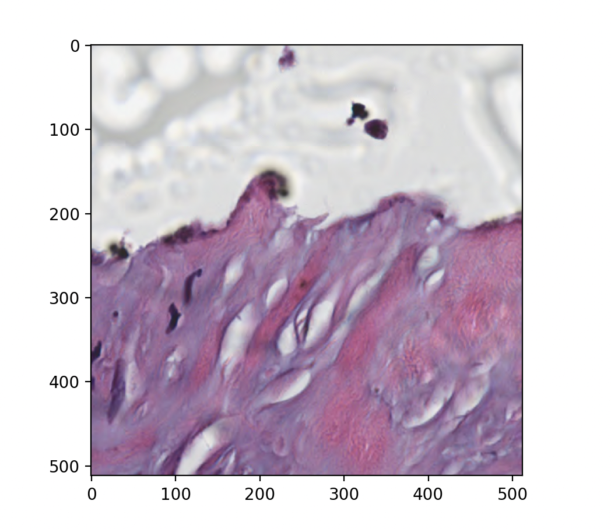

.. _remote:

Reading from Remote Filesystems
===============================

Functions like `dcmread` from pydicom and :meth:`highdicom.imread`,
:meth:`highdicom.seg.segread`, :meth:`highdicom.sr.srread`, and
:meth:`highdicom.ann.annread` from highdicom can read from any object that
exposes a "file-like" interface. Many alternative and remote filesystems have
python clients that expose such an interface, and therefore can be read from
directly.

One such example is blobs on Google Cloud Storage buckets when accessed using
the official Python SDK (installed through the `google-cloud-storage` PyPI
package). This is particularly relevant since this is the storage mechanism
underlying the `Imaging Data Commons <IDC>`_ (IDC), a large repository of
public DICOM images.

Coupling this with :ref:`"lazy" frame retrieval <lazy>` option is especially
powerful, allowing frames to be retrieved from the remote filesystem only as
and when they are needed. This is particularly useful for large multiframe
files such as those found in slide microscopy or multi-segment binary
or fractional segmentations.

In this first example, we use lazy frame retrieval to load only a specific
spatial patch from a large whole slide image from the IDC.

.. code-block:: python

  import numpy as np
  import highdicom as hd

  # Additional libraries (install these separately)
  import matplotlib.pyplot as plt
  from google.cloud import storage

  # Create a storage client and use it to access the IDC's public data package
  client = storage.Client()
  bucket = client.bucket("idc-open-data")

  # This is the path (within the above bucket) to a whole slide image from the
  # IDC collection called "CCDI MCI"
  blob = bucket.blob(
      "763fe058-7d25-4ba7-9b29-fd3d6c41dc4b/210f0529-c767-4795-9acf-bad2f4877427.dcm"
  )

  # Read directly from the blob object using lazy frame retrieval
  im = hd.imread(
      blob.open(mode="rb"),
      lazy_frame_retrieval=True
  )

  # Grab an arbitrary region of tile full pixel matrix
  region = im.get_total_pixel_matrix(
      row_start=15000,
      row_end=15512,
      column_start=17000,
      column_end=17512,
      dtype=np.uint8
  )

  # Show the region
  plt.imshow(region)
  plt.show()

   Figure produced by the above code snippet showing an arbitrary spatial
   region of a slide loaded directly from a Google Cloud bucket

As a further example, we use lazy frame retrieval to load only a specific set
of segments from a large multi-organ segmentation of a CT image in the IDC
stored in binary format (meaning each segment is stored using a separate set of
frames). See :ref:`seg` for more information on working with DICOM
segmentations.

.. code-block:: python

  import highdicom as hd

  # Additional libraries (install these separately)
  from google.cloud import storage

  # Create a storage client and use it to access the IDC's public data package
  client = storage.Client()
  bucket = client.bucket("idc-open-data")

  # This is the path (within the above bucket) to a segmentation of a CT series
  # from IDC collection called "CCDI MCI", containing a large number of
  # different organs
  blob = bucket.blob(
    "3f38511f-fd09-4e2f-89ba-bc0845fe0005/c8ea3be0-15d7-4a04-842d-00b183f53b56.dcm"
  )

  # Open the blob with "segread" using the "lazy frame retrieval" option
  seg = hd.seg.segread(
    blob.open(mode="rb"),
    lazy_frame_retrieval=True
  )

  # Find the segment number corresponding to the liver segment
  selected_segment_numbers = seg.get_segment_numbers(segment_label="Liver")

  # Read in the selected segments lazily
  volume = seg.get_volume(
      segment_numbers=selected_segment_numbers,
      combine_segments=True,
  )

This works because running the ``.open("rb")`` method on a Blob object returns
a `BlobReader <blob_reader>`_ object, which has a "file-like" interface
(specifically the ``seek``, ``read``, and ``tell`` methods). If you can provide
examples for reading from storage provided by other cloud providers, please
consider contributing them to this documentation.

.. _IDC: https://portal.imaging.datacommons.cancer.gov/
.. _blob_reader: https://cloud.google.com/python/docs/reference/storage/latest/google.cloud.storage.fileio.BlobReader
