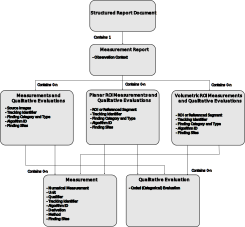

.. _tid1500:

The TID1500 Measurement Report Template
=======================================

The `TID1500 "Measurement Report" <tid1500def_>`_ template is a general-purpose
template for communicating measurements and qualitative qualitative evaluations
derived from one or more images or regions of images. It is recommended to read
the previous page on :ref:`generalsr` before this page.

*Highdicom* represents the various sub-templates of the TID1500 template as
Python classes. Using these classes will guide you through the process of
creating TID 1500 SRs in a modular and structured way, and will perform various
checks on the inputs you provide.

Overview of TID1500 Content
---------------------------

A diagram of the structure of TID1500 content is shown here:

   Simplified diagram of the structure of the TID1500 template and major
   subtemplates. Note that this is intended to give a quick overview, please
   refer to the standard itself for full details.

At the top level, the Measurement Report template
(:class:`highdicom.sr.MeasurementReport`) represents a report containing
various measurements and various metadata about the process through which they
were created.

A measurement report contains one or more "Measurement Groups", where each
group contains measurements and/or qualitative evaluations about a particular image or
image region. There are three types of Measurement Group, each of which refer
to different types of region:

- :class:`highdicom.sr.MeasurementsAndQualitativeEvaluations`
  (`TID1501 <tid1501def_>`_): Refers to one or more entire images or image
  frames.
- :class:`highdicom.sr.PlanarROIMeasurementsAndQualitativeEvaluations`
  (`TID1410 <tid1410def_>`_): Refers to a 2D region within a single image.
- :class:`highdicom.sr.VolumetricROIMeasurementsAndQualitativeEvaluations`
  (`TID1411 <tid1411def_>`_): Refers to a 3D region within an image or image
  series.

A single Measurement Report may contain a mixture of Measurement Groups of
these different types in any combination (as long as there is at least one
group).

Each Measurement Group contains a number of Measurements
(`TID300 <tid300def_>`_) - numerical values derived from an image, such as a
length or volume - and/or Qualitative Evaluations - categorical values derived
from an image, such as classification of a tumor morphology.

When constructing the content, it is necessary to start at the bottom of the
content tree with the Measurements and Evaluations and work up, by adding them
into Measurement Groups, adding these groups to a Measurement Report, and then
creating the document that contains the report. However, here we will describe
the structure from the top down as it makes the big picture clearer.

Measurement Report (`TID1500 <tid1500def_>`_)
---------------------------------------------

Every TID1500 Structured Report contains exactly one Measurement Report
at the root of its content tree. This is represented by the class
:class:`highdicom.sr.MeasurementReport`. 

The first ingredient in the Measurement Report is the "Observation Context",
which contains metadata describing the way the observations that led to the
report were made. This includes information such as the person or device that
made the observations, and the subject about which the observations were made:

.. code-block:: python

    from pydicom.sr.codedict import codes
    import highdicom as hd

    observer_person_context = hd.sr.ObserverContext(
        observer_type=codes.DCM.Person,
        observer_identifying_attributes=hd.sr.PersonObserverIdentifyingAttributes(
            name='Doe^John'
        )
    )
    observer_device_context = hd.sr.ObserverContext(
        observer_type=codes.DCM.Device,
        observer_identifying_attributes=hd.sr.DeviceObserverIdentifyingAttributes(
            uid=hd.UID()
        )
    )
    observation_context = hd.sr.ObservationContext(
        observer_person_context=observer_person_context,
        observer_device_context=observer_device_context,
    )

The second required ingredient is a procedure code describing the procedure
that was performed to result in the observations. Finally, we have the image
measurement groups that the report contains (described below). There are some
further optional parameters, such as a title for the report. Combining these we
can construct the Measurement Report, and use it to construct the SR document:

.. code-block:: python

    from pydicom.sr.codedict import codes
    import highdicom as hd

    measurement_report = hd.sr.MeasurementReport(
        observation_context=observation_context,  # from above
        procedure_reported=codes.LN.CTUnspecifiedBodyRegion,
        imaging_measurements=[...],  # list of measurement groups, see below
        title=codes.DCM.ImagingMeasurementReport,
    )

    # Create the Structured Report instance
    sr_dataset = hd.sr.Comprehensive3DSR(
        evidence=[...],  # all datasets referenced in the report
        content=measurement_report,
        series_number=1,
        series_instance_uid=hd.UID(),
        sop_instance_uid=hd.UID(),
        instance_number=1,
        manufacturer='Manufacturer'
    )

Measurement Groups
------------------

A Measurement Report contains one or more Measurement Groups. There are three
types of Measurement Groups, corresponding to entire images, 2D regions of
interest, and 3D regions of interest. The three types may be mixed and matched
within a single Measurement Report in any combination.

Measurements And Qualitative Evaluations Group (`TID1501 <tid1501def_>`_)
~~~~~~~~~~~~~~~~~~~~~~~~~~~~~~~~~~~~~~~~~~~~~~~~~~~~~~~~~~~~~~~~~~~~~~~~~

The first, and simplest, type of Measurement Group applies to one or more
entire images (or alternatively one or more entire frames in the case of
multiframe source images). This is implemented using
:class:`highdicom.sr.MeasurementsAndQualitativeEvaluations`.

This class also accepts a parameter ``source_images``, which is a sequence of
:class:`highdicom.sr.SourceImageForMeasurementGroup` items specifying the
images (or frames) to which the measurement group applies. If this is omitted,
the measurement group is assumed to include all images referenced in the SR
document (as passed in the ``evidence`` parameter of the relevant Structured
Report object's ``__init__`` method).

The following is a simple example:

.. code-block:: python

    import highdicom as hd
    from pydicom import dcmread

    im = dcmread('/path/to/file.dcm')

    # A tracking identifier for this measurement group
    tracking_id = hd.sr.TrackingIdentifier(
       identifier='Image0001',
       uid=hd.UID(),
    )

    # An object describing the source image for the measurements
    source_image = hd.sr.SourceImageForMeasurementGroup.from_source_image(im)

    # Construct the measurement group
    group = hd.sr.MeasurementsAndQualitativeEvaluations(
       source_images=[source_image],
       tracking_identifier=tracking_id,
       measurements=[...],
       qualitative_evaluations=[...],
    )

Planar ROI Image Measurements Group (`TID1410 <tid1410def_>`_)
~~~~~~~~~~~~~~~~~~~~~~~~~~~~~~~~~~~~~~~~~~~~~~~~~~~~~~~~~~~~~~

This type of Measurement Group applies to a specific planar sub-region of the
source image or images. This is implemented in the class
:class:`highdicom.sr.PlanarROIMeasurementsAndQualitativeEvaluations`.

This class takes a parameter specifying the region. There are two distinct
options here:

- ``referenced_region``: The image region is specified directly in the SR
  using a :class:`highdicom.sr.ImageRegion` or
  :class:`highdicom.sr.ImageRegion3D` passed as the ``referenced_region``
  parameter. In this case, the coordinates defining the region are stored
  within the measurement group itself. The choice between
  :class:`highdicom.sr.ImageRegion` and :class:`highdicom.sr.ImageRegion3D`
  determines whether the image region is defined in 2D image coordinates or 3D
  frame-of-reference coordinates. Either way, the region must be planar.
- ``referenced_segment``: The region is specified indirectly as a reference to
  a single slice of a single segment stored in a separate DICOM Segmentation
  Image object, specified by passing a
  :class:`highdicom.sr.ReferencedSegmentationFrame` to the
  ``referenced_segment`` parameter, which contains UIDs to identify the
  Segmentation Image along with the segment number of the specific segment and
  the frames within which it is stored.

Note that **either** ``referenced_region`` or ``referenced_segment``
should be passed, and not both (or neither).

The following example uses an :class:`highdicom.sr.ImageRegion` as the
``referenced_region``:

.. code-block:: python

    import highdicom as hd
    import numpy as np
    from pydicom import dcmread

    im = dcmread('/path/to/file.dcm')

    # A tracking identifier for this measurement group
    tracking_id = hd.sr.TrackingIdentifier(
       identifier='Region0001',
       uid=hd.UID(),
    )

    # Define the image region (a circle) using image coordinates
    region = hd.sr.ImageRegion(
       graphic_type=hd.sr.GraphicTypeValues.CIRCLE,
       graphic_data=np.array([[45.0, 55.0], [45.0, 65.0]]),
       source_image=hd.sr.SourceImageForRegion.from_source_image(im),
    )

    # Construct the measurement group
    group = hd.sr.PlanarROIMeasurementsAndQualitativeEvaluations(
       referenced_region=region,
       tracking_identifier=tracking_id,
       measurements=[...],
       qualitative_evaluations=[...],
    )

This example uses an :class:`highdicom.sr.ImageRegion3D` as the
``referenced_region``:

.. code-block:: python

    import highdicom as hd
    import numpy as np
    from pydicom import dcmread

    im = dcmread('/path/to/file.dcm')

    # A tracking identifier for this measurement group
    tracking_id = hd.sr.TrackingIdentifier(
       identifier='Region3D0001',
       uid=hd.UID(),
    )

    # Define the image region (a point) using frame-of-reference coordinates
    region = hd.sr.ImageRegion3D(
       graphic_type=hd.sr.GraphicTypeValues3D.POINT,
       graphic_data=np.array([[123.5, 234.1, -23.7]]),
       frame_of_reference_uid=im.FrameOfReferenceUID,
    )

    # Construct the measurement group
    group = hd.sr.PlanarROIMeasurementsAndQualitativeEvaluations(
       referenced_region=region,
       tracking_identifier=tracking_id,
       measurements=[...],
       qualitative_evaluations=[...],
    )

The final example uses an :class:`highdicom.sr.ReferencedSegmentationFrame` as
the ``referenced_segment``:

.. code-block:: python

    import highdicom as hd
    import numpy as np
    from pydicom import dcmread

    # The image dataset referenced
    im = dcmread('/path/to/file.dcm')

    # A segmentation dataset, assumed to contain a segmentation of the source
    # image above
    seg = dcmread('/path/to/seg.dcm')

    # A tracking identifier for this measurement group
    tracking_id = hd.sr.TrackingIdentifier(
       identifier='Region3D0001',
       uid=hd.UID(),
    )

    # Define the image region using a specific segment from the segmentation
    ref_segment = hd.sr.ReferencedSegmentationFrame.from_segmentation(
       segmentation=seg,
       segment_number=1,
    )

    # Construct the measurement group
    group = hd.sr.PlanarROIMeasurementsAndQualitativeEvaluations(
       referenced_segment=ref_segment,
       tracking_identifier=tracking_id,
       measurements=[...],
       qualitative_evaluations=[...],
    )

Volumetric ROI Image Measurements Group (`TID1411 <tid1411def_>`_)
~~~~~~~~~~~~~~~~~~~~~~~~~~~~~~~~~~~~~~~~~~~~~~~~~~~~~~~~~~~~~~~~~~

This type of Measurement Group applies to a specific volumetric sub-region of
the source image or images. This is implemented in the class
:class:`highdicom.sr.VolumetricROIMeasurementsAndQualitativeEvaluations`.

Like the similar Planar ROI class, this class takes a parameter
specifying the region. In this case there are three options:

- ``referenced_regions``: The image region is specified directly in the SR in
  image coordinates using one or more objects of type
  :class:`highdicom.sr.ImageRegion` passed as the ``referenced_regions``
  parameter, representing the volumetric region as a set of 2D regions across
  multiple images or frames.
- ``referenced_volume_surface``: The region is specified directly in the SR as
  a single volumetric region defined in frame of reference coordinates using a
  single :class:`highdicom.sr.VolumeSurface` object passed to the
  ``referenced_volume_surface`` parameter.
- ``referenced_segment``: The region is specified indirectly as a reference to
  an entire segment (which may spread across multiple images or frames) of a
  Segmentation Image object, specified by passing a
  :class:`highdicom.sr.ReferencedSegment` to the ``referenced_segment``
  parameter, which contains UIDs to identify the Segmentation Image along with
  the segment number of the specific segment within it.

Note that exactly one of ``referenced_regions``, ``referenced_volume_surface``,
or ``referenced_segment`` should be passed.

The following example uses a list of :class:`highdicom.sr.ImageRegion` objects
as the ``referenced_regions``:

.. code-block:: python

    import highdicom as hd
    import numpy as np
    from pydicom import dcmread

    im1 = dcmread('/path/to/file1.dcm')
    im2 = dcmread('/path/to/file2.dcm')

    # A tracking identifier for this measurement group
    tracking_id = hd.sr.TrackingIdentifier(
       identifier='Region0001',
       uid=hd.UID(),
    )

    # Define the image regions (a circle in two images) using image coordinates
    region1 = hd.sr.ImageRegion(
       graphic_type=hd.sr.GraphicTypeValues.CIRCLE,
       graphic_data=np.array([[45.0, 55.0], [45.0, 65.0]]),
       source_image=hd.sr.SourceImageForRegion.from_source_image(im1),
    )
    region2 = hd.sr.ImageRegion(
       graphic_type=hd.sr.GraphicTypeValues.CIRCLE,
       graphic_data=np.array([[40.0, 50.0], [40.0, 60.0]]),
       source_image=hd.sr.SourceImageForRegion.from_source_image(im2),
    )

    # Construct the measurement group
    group = hd.sr.VolumetricROIMeasurementsAndQualitativeEvaluations(
       referenced_regions=[region1, region2],
       tracking_identifier=tracking_id,
       measurements=[...],
       qualitative_evaluations=[...],
    )

This example uses a :class:`highdicom.sr.VolumeSurface` object as the
``referenced_volume_surface``:

.. code-block:: python

    import highdicom as hd
    import numpy as np
    from pydicom import dcmread

    im = dcmread('/path/to/file.dcm')

    # A tracking identifier for this measurement group
    tracking_id = hd.sr.TrackingIdentifier(
       identifier='Region0001',
       uid=hd.UID(),
    )

    # Define the image region (a point) using frame-of-reference coordinates
    volume_surface = hd.sr.VolumeSurface(
        graphic_type=hd.sr.GraphicTypeValues.POINT,
        graphic_data=np.array([[123.5, 234.1, -23.7]]),
        source_images=[hd.sr.SourceImageForSegmentation.from_source_image(im)],
        frame_of_reference_uid=im.FrameOfReferenceUID,
    )

    # Construct the measurement group
    group = hd.sr.VolumetricROIMeasurementsAndQualitativeEvaluations(
       referenced_volume_surface=volume_surface,
       tracking_identifier=tracking_id,
       measurements=[...],
       qualitative_evaluations=[...],
    )

The final example uses an :class:`highdicom.sr.ReferencedSegment` as the
``referenced_segment``:

.. code-block:: python

    import highdicom as hd
    import numpy as np
    from pydicom import dcmread

    # The image dataset referenced
    im = dcmread('/path/to/file.dcm')

    # A segmentation dataset, assumed to contain a segmentation of the source
    # image above
    seg = dcmread('/path/to/seg.dcm')

    # A tracking identifier for this measurement group
    tracking_id = hd.sr.TrackingIdentifier(
       identifier='Region3D0001',
       uid=hd.UID(),
    )

    # Define the image region using a specific segment from the segmentation
    ref_segment = hd.sr.ReferencedSegment.from_segmentation(
       segmentation=seg,
       segment_number=1,
    )

    # Construct the measurement group
    group = hd.sr.VolumetricROIMeasurementsAndQualitativeEvaluations(
       referenced_segment=ref_segment,
       tracking_identifier=tracking_id,
       measurements=[...],
       qualitative_evaluations=[...],
    )

Further Parameters for Measurement Groups
~~~~~~~~~~~~~~~~~~~~~~~~~~~~~~~~~~~~~~~~~

The three types of measurement group are more alike than different. The
following parameters may be used for all Measurement Groups, regardless of
type (some have been omitted for brevity):

- ``tracking_identifier`` (:class:`highdicom.sr.TrackingIdentifier`):
    Identifier for tracking measurement groups. This allows this region to
    be referred to unambiguously in future objects.
- ``finding_type`` (:class:`highdicom.sr.CodedConcept`, optional)
    Type of observed finding
- ``algorithm_id``: (:class:`highdicom.sr.AlgorithmIdentification`, optional)
    Identification of algorithm used for making measurements.
- ``finding_sites``: (Sequence of :class:`highdicom.sr.FindingSite`, optional)
    Coded description of one or more anatomic locations at which
    finding was observed
- ``measurements``: (Sequence of :class:`highdicom.sr.Measurement`, optional)
    Numeric measurements
- ``qualitative_evaluations``: (Sequence of :class:`highdicom.sr.CodedConcept`, optional)
    Coded name-value pairs that describe qualitative qualitative_evaluations
- ``finding_category``: (:class:`highdicom.sr.CodedConcept`, optional)
    Category of observed finding, e.g., anatomic structure or
    morphologically abnormal structure

Measurements and Qualitative Evaluations
----------------------------------------

Finally, we get down to the bottom of the content tree, and the measurements
and qualitative evaluations themselves. Information derived from the images or
image regions represented by the measurement group may be stored as either
measurements, qualitative evaluations, or a mixture or the two. These two
concepts play a similar role in the SR, but measurements have numerical values
and qualitative evaluations have categorical values.

Qualitative Evaluations
~~~~~~~~~~~~~~~~~~~~~~~

A Qualitative Evaluation is essentially a categorical value inferred from an
image. For example, this could represent a diagnosis derived from the
referenced region or a severity grading. These are represented in *highdicom*
using the class :class:`highdicom.sr.QualitativeEvalution`, which is
essentially a single :class:`highdicom.sr.CodeContentItem` within a special
template.

To create a Qualitative Evaluation, just pass the ``name`` and ``value``
parameters as coded values:

.. code-block:: python

    import highdicom as hd
    from pydicom.sr.codedict import codes

    # An evaluation of disease severity as "mild"
    severity_item = hd.sr.QualitativeEvalution(
       name=codes.SCT.Severity,
       value=codes.SCT.Mild,
    )

    # An evaluation of tumor morphology as adenocarcinoma
    morphology_item = hd.sr.QualitativeEvalution(
       name=codes.SCT.AssociatedMorphology,
       value=codes.SCT.Anenocarcinoma,
    )

Measurements (`TID300 <tid300def_>`_)
~~~~~~~~~~~~~~~~~~~~~~~~~~~~~~~~~~~~~

A Measurement is essentially a numerical (decimal) value derived from the image
or image region. In *highdicom*, a measurement is represented by the class
:class:`highdicom.sr.Measurement`. It is a small template that contains at its
core a :class:`highdicom.sr.NumContentItem` containing the value, a
:class:`highdicom.sr.CodeContentItem` specifying the unit of the measurement,
and optionally several more content items describing further context or
qualifications for the measurement.

Here is a basic example:

.. code-block:: python

    import highdicom as hd
    from pydicom.sr.codedict import codes

    # A volume measurement
    measurement = hd.sr.Measurement(
       name=codes.SCT.Volume,
       value=1983.123,
       unit=codes.UCUM.CubicMillimeter,
    )

In addition, the following optional parameters are available (see the API
reference for more information):

- **Qualifier:** Qualification of the measurement.
- **Tracking Identifier:** Identifier for uniquely identifying and tracking
  measurements.
- **Algorithm:** Identification of algorithm used for making measurements.
- **Derivation:** How the value was computed.
- **Finding Sites:** Coded description of one or more anatomic locations
  corresponding to the image region from which measurement was taken.
- **Method:** Measurement method.
- **Properties:** Measurement properties, including qualitative evaluations of its
  normality and/or significance, its relationship to a reference population,
  and an indication of its selection from a set of measurements
- **Referenced Images:** Referenced images which were used as sources for the
  measurement.
- **Referenced Real World Value Map:**
  Referenced real world value map for referenced source images used to
  generate the measurement.

.. _tid1500_full_example:

Putting It All Together
-----------------------

The snippet below is a full example of creating an SR document using the
TID1500 template. You can find the file created by this snippet in the
highdicom test data within the highdicom repository at
``data/test_files/sr_document_with_multiple_groups.dcm``.

.. code-block:: python

    import numpy as np
    from pydicom.sr.codedict import codes
    import pydicom
    import highdicom as hd

    im = pydicom.dcmread("data/test_files/ct_image.dcm")

    # Information about the observer
    observer_person_context = hd.sr.ObserverContext(
        observer_type=codes.DCM.Person,
        observer_identifying_attributes=hd.sr.PersonObserverIdentifyingAttributes(
            name='Doe^John'
        )
    )
    observer_device_context = hd.sr.ObserverContext(
        observer_type=codes.DCM.Device,
        observer_identifying_attributes=hd.sr.DeviceObserverIdentifyingAttributes(
            uid=hd.UID()
        )
    )
    observation_context = hd.sr.ObservationContext(
        observer_person_context=observer_person_context,
        observer_device_context=observer_device_context,
    )

    # An object describing the source image for the measurements
    source_image = hd.sr.SourceImageForMeasurementGroup.from_source_image(im)

    # First, we define an image measurement group for the CT image describing
    # the intensity histogram at a certain vertebral level

    # A tracking identifier for this measurement group
    im_tracking_id = hd.sr.TrackingIdentifier(
       identifier='Image0001',
       uid=hd.UID(),
    )

    # A measurement using an IBSI code (not in pydicom)
    histogram_intensity_code = hd.sr.CodedConcept(
        value="X6K6",
        meaning="Intensity Histogram Mean",
        scheme_designator="IBSI",
    )
    hist_measurement = hd.sr.Measurement(
        name=histogram_intensity_code,
        value=-119.0738525390625,
        unit=codes.UCUM.HounsfieldUnit,
    )
    im_evaluation = hd.sr.QualitativeEvaluation(
        name=codes.SCT.AnatomicalPosition,
        value=codes.SCT.LevelOfT4T5IntervertebralDisc,
    )

    # Construct the measurement group
    im_group = hd.sr.MeasurementsAndQualitativeEvaluations(
       source_images=[source_image],
       tracking_identifier=im_tracking_id,
       measurements=[hist_measurement],
       qualitative_evaluations=[im_evaluation],
    )

    # Next, we define a planar ROI measurement group describing a lung nodule

    # A tracking identifier for this measurement group
    lung_nodule_roi_tracking_id = hd.sr.TrackingIdentifier(
       identifier='LungNodule0001',
       uid=hd.UID(),
    )

    # Define the image region (a circle) using image coordinates
    region = hd.sr.ImageRegion(
       graphic_type=hd.sr.GraphicTypeValues.CIRCLE,
       graphic_data=np.array([[45.0, 55.0], [45.0, 65.0]]),
       source_image=hd.sr.SourceImageForRegion.from_source_image(im),
    )
    nodule_measurement = hd.sr.Measurement(
        name=codes.SCT.Diameter,
        value=10.0,
        unit=codes.UCUM.mm,
    )
    nodule_evaluation = hd.sr.QualitativeEvaluation(
        name=codes.DCM.LevelOfSignificance,
        value=codes.SCT.NotSignificant,
    )

    # Construct the measurement group
    planar_group_1 = hd.sr.PlanarROIMeasurementsAndQualitativeEvaluations(
       referenced_region=region,
       tracking_identifier=lung_nodule_roi_tracking_id,
       finding_type=codes.SCT.Nodule,
       finding_category=codes.SCT.MorphologicallyAbnormalStructure,
       finding_sites=[hd.sr.FindingSite(codes.SCT.Lung)],
       measurements=[nodule_measurement],
       qualitative_evaluations=[nodule_evaluation],
    )

    # Next, we define a second planar ROI measurement group describing the
    # aorta

    # A tracking identifier for this measurement group
    aorta_roi_tracking_id = hd.sr.TrackingIdentifier(
       identifier='Aorta0001',
       uid=hd.UID(),
    )

    # Define the image region (a circle) using image coordinates
    region = hd.sr.ImageRegion(
       graphic_type=hd.sr.GraphicTypeValues.POLYLINE,
       graphic_data=np.array([[25.0, 45.0], [45.0, 45.0], [45.0, 65.0], [25.0, 65.0]]),
       source_image=hd.sr.SourceImageForRegion.from_source_image(im),
    )
    aorta_measurement = hd.sr.Measurement(
        name=codes.SCT.Diameter,
        value=20.0,
        unit=codes.UCUM.mm,
    )

    # Construct the measurement group
    planar_group_2 = hd.sr.PlanarROIMeasurementsAndQualitativeEvaluations(
       referenced_region=region,
       tracking_identifier=aorta_roi_tracking_id,
       finding_type=codes.SCT.Aorta,
       finding_category=structure_code,
       measurements=[aorta_measurement],
    )

    # Finally, we define a volumetric ROI measurement group describing a
    # vertebral body

    # A tracking identifier for this measurement group
    volumetric_roi_tracking_id = hd.sr.TrackingIdentifier(
       identifier='Vertebra0001',
       uid=hd.UID(),
    )

    # Define the region (a point) using frame of reference coordinates
    volume_surface = hd.sr.VolumeSurface(
        graphic_type=hd.sr.GraphicTypeValues3D.POINT,
        graphic_data=np.array([[123.5, 234.1, -23.7]]),
        source_images=[hd.sr.SourceImageForSegmentation.from_source_image(im)],
        frame_of_reference_uid=im.FrameOfReferenceUID,
    )
    vol_measurement = hd.sr.Measurement(
        name=codes.SCT.Volume,
        value=200.0,
        unit=codes.UCUM.CubicMillimeter,
    )

    # Construct the measurement group
    vol_group = hd.sr.VolumetricROIMeasurementsAndQualitativeEvaluations(
       referenced_volume_surface=volume_surface,
       tracking_identifier=volumetric_roi_tracking_id,
       finding_category=structure_code,
       finding_type=codes.SCT.Vertebra,
       measurements=[vol_measurement],
    )

    measurement_report = hd.sr.MeasurementReport(
        observation_context=observation_context,  # from above
        procedure_reported=codes.LN.CTUnspecifiedBodyRegion,
        imaging_measurements=[im_group, planar_group_1, planar_group_2, vol_group],
        title=codes.DCM.ImagingMeasurementReport,
    )

    # Create the Structured Report instance
    sr_dataset = hd.sr.Comprehensive3DSR(
        evidence=[im],  # all datasets referenced in the report
        content=measurement_report,
        series_number=1,
        series_instance_uid=hd.UID(),
        sop_instance_uid=hd.UID(),
        instance_number=1,
        manufacturer='Manufacturer'
    )
    sr_dataset.save_as("sr_document_with_multiple_groups.dcm")

.. _tid300def: https://dicom.nema.org/medical/dicom/current/output/chtml/part16/chapter_A.html#sect_TID_300
.. _tid1500def: https://dicom.nema.org/medical/dicom/current/output/chtml/part16/chapter_A.html#sect_TID_1500
.. _tid1501def: https://dicom.nema.org/medical/dicom/current/output/chtml/part16/chapter_A.html#sect_TID_1501
.. _tid1410def: https://dicom.nema.org/medical/dicom/current/output/chtml/part16/chapter_A.html#sect_TID_1410
.. _tid1411def: https://dicom.nema.org/medical/dicom/current/output/chtml/part16/chapter_A.html#sect_TID_1411
